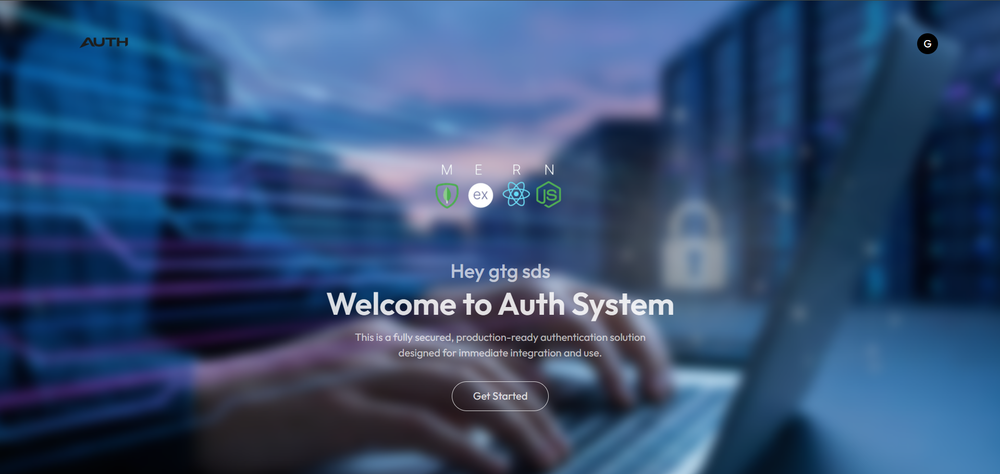

# MERN Authentication & Authorization System 🔐



A production-ready, role-based authentication and authorization system for MERN applications. This project provides secure user registration, email verification, password reset via OTP, and role-based access control (User / Admin). It's designed for easy integration into existing MERN applications.

---

## ✅ Key Features

- **User registration & login** with secure password hashing
- **Email verification** after registration
- **Password reset** via email OTP using modern email templates
- **Role-based access control** (User / Admin)
- **JWT authentication** and middleware for protected routes
- **Modular structure** for straightforward integration and extension

---

## 🧰 Tech Stack

- Frontend: React (Vite)
- Backend: Node.js, Express
- Database: MongoDB
- Auth: JSON Web Tokens (JWT)
- Email: Nodemailer (SMTP)

---

## 📁 Project Structure

```
project-root/
├── client/          # React frontend (Vite)
│   ├── src/         # React source files
│   └── public/      # Static assets
└── server/          # Node.js + Express backend
    ├── controllers/ # Route handlers
    ├── models/      # Mongoose models
    ├── routes/      # Express routes
    └── config/      # DB and email configuration
```

---

## ⚙️ Environment Variables

Create `.env` files in the `client` and `server` directories. Example values:

Client (`client/.env`)

```
VITE_BACKEND_URL="http://localhost:4000"
```

Server (`server/.env`)

```
MONGODB_URI=your_mongodb_connection_string
JWT_SECRET=your_jwt_secret_for_users
JWT_SECRET_ADMIN=your_jwt_secret_for_admins
NODE_ENV=development
SENDER_EMAIL=your_email_address@example.com
SMTP_PASS=your_email_smtp_password
```

---

## 🚀 Quick Start

Prerequisites: Node.js and npm installed, MongoDB available (local or cloud).

1. Backend

```bash
cd server
npm install
npm run dev
```

- The backend defaults to `http://localhost:4000`.

2. Frontend

```bash
cd client
npm install
npm run dev
```

- The frontend typically runs on `http://localhost:5173` (Vite).

---


---

If you'd like, I can also add a short API reference, badges (build / license), or a deployment section—tell me which you'd prefer next. ✨


